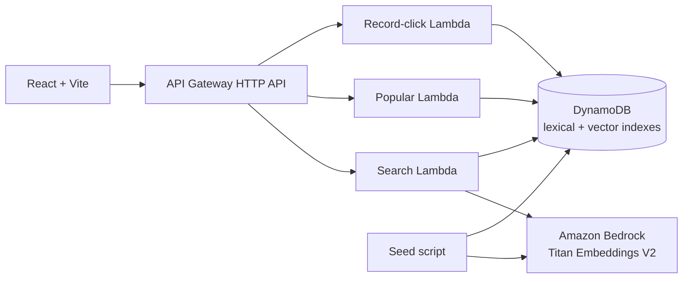

# Serverless Product Search with DynamoDB Vector Search

A small, production-minded product search example built with TypeScript, AWS CDK,
DynamoDB vector search, Amazon Bedrock, API Gateway, Lambda, and React.

The application combines three signals to rank product suggestions:

- lexical matches against normalized product names and descriptions;
- semantic similarity from 512-dimensional Amazon Titan Text Embeddings V2 vectors;
- product popularity, incremented whenever a suggestion is selected.

Search remains available in lexical-only mode if semantic search fails. The repository also
includes an accessible, keyboard-navigable React search box for exercising the API locally.

## Architecture



AWS CDK provisions:

- a pay-per-request DynamoDB table with point-in-time recovery;
- an autocomplete GSI, a popularity GSI, and a cosine-distance vector index;
- three Node.js 24 Lambda functions;
- an API Gateway HTTP API with throttling, CORS, and one-week access-log retention;
- least-privilege access from the functions to DynamoDB and Amazon Bedrock.

The frontend is intentionally run locally and is not included in the deployed stack.

## Prerequisites

- Node.js 24 or newer
- npm 11 or newer
- an AWS account and configured AWS credentials
- an AWS Region where DynamoDB vector search and the
  `amazon.titan-embed-text-v2:0` Bedrock model are available to your account
- a bootstrapped AWS CDK environment

Install the workspace dependencies:

```bash
npm install
```

If this AWS account and Region have not been bootstrapped for CDK yet, run:

```bash
npm run cdk -- bootstrap
```

## Validate the project locally

These commands do not deploy infrastructure:

```bash
npm run build
npm test
npm run lint
npm run format:check
npm run cdk:synth
npm run seed -- --dry-run
```

The dry run validates `data/products.json` without making AWS calls or writing data.

## Deploy and seed

Deploy a development stack and write its outputs to `cdk-outputs.json`:

```bash
npm run cdk:deploy -- --context stage=dev
```

Then generate embeddings and seed the catalog:

```bash
npm run seed
```

The seed script reads the generated table and vector-index names from `cdk-outputs.json`, waits
for the vector index to become active, invokes Titan Text Embeddings V2, and writes each product
idempotently. Existing popularity scores are preserved. To intentionally reset every seeded
product to a score of `1`, run:

```bash
npm run seed -- --reset-scores
```

You can target resources without a CDK outputs file:

```bash
npm run seed -- \
  --table-name YOUR_TABLE_NAME \
  --vector-index-name ProductEmbeddingIndex \
  --region YOUR_AWS_REGION
```

Other seed options are `--outputs FILE`, `--dry-run`, and `--reset-scores`.

> [!IMPORTANT]
> The default stage is `prod`. Its DynamoDB table and configured log groups are retained, and the
> table has deletion protection enabled. The `dev` and `demo` stages use a destroy removal policy
> and disable deletion protection, making them suitable for disposable environments.

## Run the frontend locally

Copy the example environment file:

```bash
cp apps/web/.env.example apps/web/.env.local
```

Set `VITE_API_BASE_URL` to the deployed `ApiUrl` value in `cdk-outputs.json`, without a trailing
slash:

```dotenv
VITE_API_BASE_URL=https://example.execute-api.us-east-1.amazonaws.com
```

Start Vite:

```bash
npm run dev:web
```

Open <http://localhost:5173>. Focusing the empty search box loads popular products; entering at
least two characters performs a debounced hybrid search. Selecting a suggestion increments its
popularity score.

The deployed API allows `http://localhost:5173` by default. To use a different frontend origin,
pass it during deployment:

```bash
npm run cdk:deploy -- \
  --context stage=dev \
  --context frontendOrigin=https://your-frontend.example
```

## API

All list endpoints return up to five results. An absent or invalid `limit` defaults to `5`; valid
values are clamped to the range from `1` to `5`.

| Method | Route                              | Description                                                                                    |
| ------ | ---------------------------------- | ---------------------------------------------------------------------------------------------- |
| `GET`  | `/popular?limit=5`                 | Returns products ordered by descending popularity.                                             |
| `GET`  | `/search?q=summer%20shoes&limit=5` | Returns ranked lexical and semantic matches. Queries must contain 2–100 normalized characters. |
| `POST` | `/products/{id}/click`             | Increments the score for an existing UUID product ID.                                          |

With the deployed URL in a shell variable, try:

```bash
SEARCH_API_URL=https://example.execute-api.us-east-1.amazonaws.com

curl "$SEARCH_API_URL/popular?limit=5"
curl "$SEARCH_API_URL/search?q=summer%20shoes&limit=5"
curl -X POST "$SEARCH_API_URL/products/81d04927-ee96-4b17-82f4-83e9bee705a4/click"
```

A search result includes the public product fields plus match metadata:

```json
{
  "query": "summer shoes",
  "items": [
    {
      "id": "81d04927-ee96-4b17-82f4-83e9bee705a4",
      "name": "Cloud Runner Shoes",
      "description": "Lightweight running shoes for warm-weather training.",
      "category": "footwear",
      "score": 1,
      "match": {
        "kind": "hybrid",
        "rankingScore": 0.81
      }
    }
  ]
}
```

The exact ranking score depends on the current candidate set and popularity values.

## Run the deployed smoke test

After deploying and seeding, set the stack's `ApiUrl` and run the test suite:

```bash
SEARCH_API_URL=https://example.execute-api.us-east-1.amazonaws.com npm test
```

When `SEARCH_API_URL` is set, the integration test performs a semantic search and records a real
click. Without it, the deployed integration test is skipped and the local unit tests still run.

## Catalog format

The human-editable catalog lives in `data/products.json`. Embeddings are generated during seeding
and are deliberately not committed. Each product must contain:

```json
{
  "id": "81d04927-ee96-4b17-82f4-83e9bee705a4",
  "name": "Cloud Runner Shoes",
  "description": "Lightweight running shoes for warm-weather training.",
  "category": "footwear",
  "tags": ["running", "lightweight"],
  "imageUrl": "https://example.com/cloud-runner.webp"
}
```

`id` must be a UUID. `imageUrl` is optional. The seed command validates all products using the
shared Zod contract before generating embeddings or writing to DynamoDB.

## Project layout

| Path                 | Purpose                                                                             |
| -------------------- | ----------------------------------------------------------------------------------- |
| `apps/web`           | Local React and Vite search interface.                                              |
| `packages/shared`    | API schemas, normalization, embedding input, and deterministic ranking logic.       |
| `data/products.json` | Source product catalog.                                                             |
| `infra`              | CDK stack, Lambda handlers, vector-index custom resource, and infrastructure tests. |
| `scripts/seed.ts`    | Catalog validation, embedding generation, and idempotent DynamoDB seeding.          |

## Commands

| Command                | Description                                                    |
| ---------------------- | -------------------------------------------------------------- |
| `npm run build`        | Type-check and build all TypeScript projects.                  |
| `npm test`             | Run the Vitest suite once.                                     |
| `npm run test:watch`   | Run Vitest in watch mode.                                      |
| `npm run lint`         | Lint the repository with ESLint.                               |
| `npm run format:check` | Check formatting with Prettier.                                |
| `npm run format`       | Format the repository with Prettier.                           |
| `npm run cdk:synth`    | Synthesize the CloudFormation template and run CDK Nag checks. |
| `npm run cdk:deploy`   | Deploy the stack and write `cdk-outputs.json`.                 |
| `npm run cdk:destroy`  | Destroy stack resources permitted by their removal policies.   |
| `npm run seed`         | Validate, embed, and seed the product catalog.                 |
| `npm run dev:web`      | Start the local Vite development server.                       |
| `npm run build:web`    | Build the frontend for production.                             |
